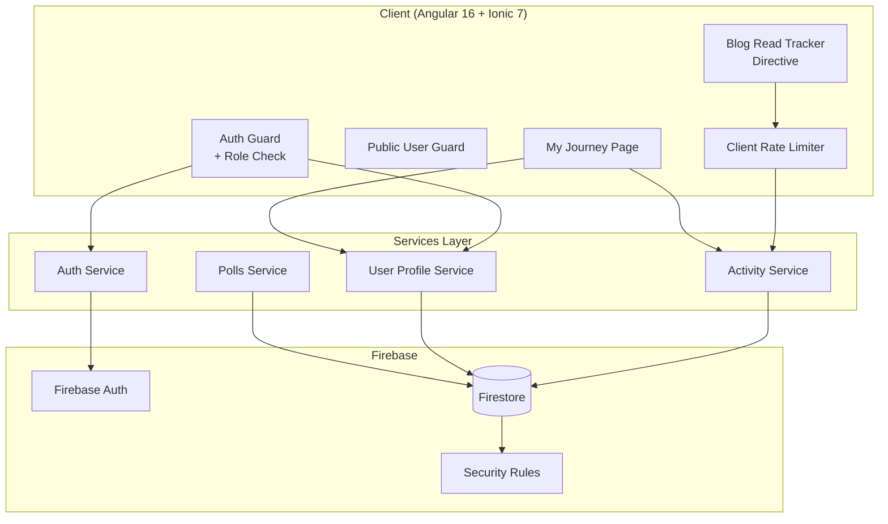
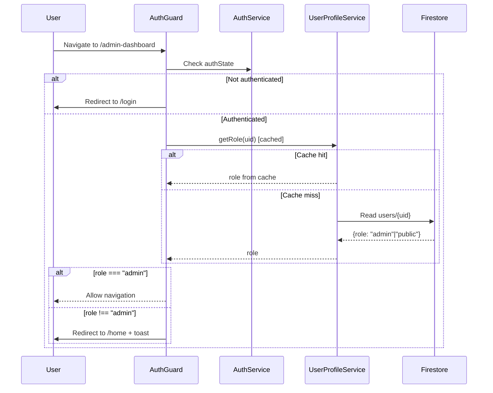
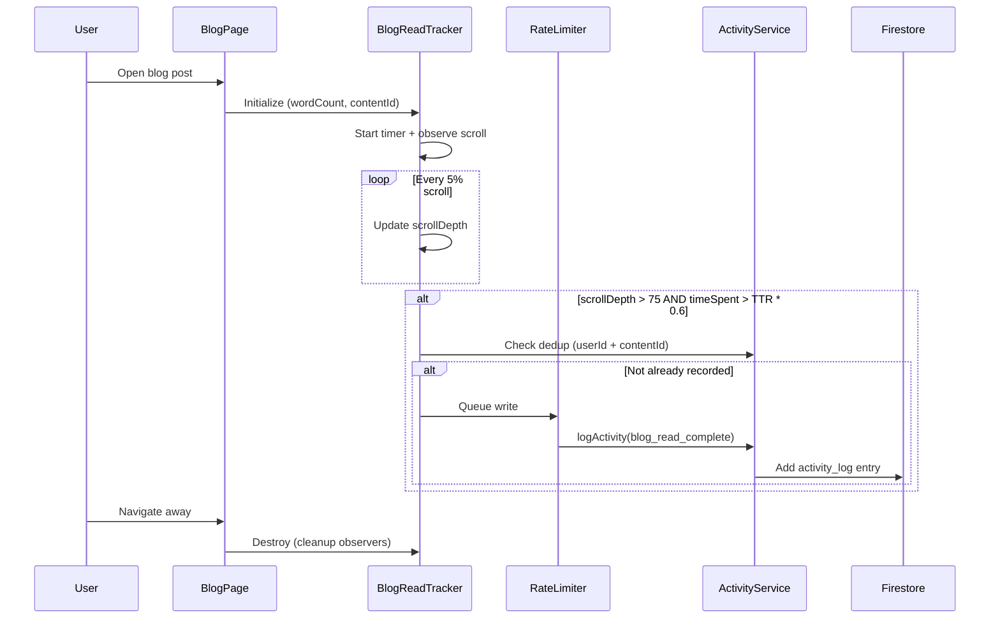

# Design Document: Security and Engagement Tracking

## Overview

This design enhances the WIOF platform in two complementary domains: **security hardening** and **engagement tracking depth**. The security layer introduces role-based access control (RBAC), tightened Firestore rules, and rate limiting to prevent unauthorized data modification. The engagement layer adds smart blog read completion detection, EQ score history with dimension breakdowns, and poll vote tracking linked to user accounts — all surfaced on an enhanced My Journey page.

The architecture leverages the existing Angular 16 + Ionic 7 + Firebase stack, extending the current `UserProfileService`, `ActivityService`, and `AuthGuard` patterns with minimal refactoring. Firestore Security Rules are the primary enforcement layer, with client-side guards and throttling as defense-in-depth.

### Key Design Decisions

1. **Role stored in Firestore, not Firebase Custom Claims**: The existing `users` collection already holds profile data. Adding a `role` field keeps the architecture simple and avoids Cloud Functions dependency for a small user base. The tradeoff is an extra Firestore read on first navigation, mitigated by session-level caching.

2. **Client-side rate limiting + Firestore rule enforcement**: Dual-layer protection — client throttles reduce noise, Firestore rules enforce hard limits regardless of client behavior.

3. **Blog read completion as Activity Log entry**: Reuses the existing `activity_log` collection pattern rather than creating a separate collection, keeping queries and the My Journey page data model unified.

4. **Scroll/time tracking via IntersectionObserver + timer**: Avoids heavy scroll event listeners; uses Angular directive for reuse.

## Architecture



### Request Flow: Admin Route Access



### Request Flow: Blog Read Completion



## Components and Interfaces

### 1. UserProfile Model Enhancement

```typescript
export interface UserProfile {
  uid: string;
  displayName: string;
  email: string;
  photoURL: string;
  role: 'admin' | 'public';  // NEW
  joinedDate: firebase.firestore.Timestamp;
  preferredElements: string[];
  lastLogin: firebase.firestore.Timestamp;
  loginCount: number;
  daysVisited: number;
  currentStreak: number;
  savedBlogsCount: number;
}
```

### 2. UserProfileService Extensions

```typescript
// New method for role retrieval with caching
export class UserProfileService {
  private roleCache: Map<string, 'admin' | 'public'> = new Map();

  /**
   * Returns the user's role, using session cache.
   * Legacy profiles without a role field default to 'public'.
   */
  async getRole(uid: string): Promise<'admin' | 'public'> { ... }

  /**
   * Clears the role cache (called on logout).
   */
  clearRoleCache(): void { ... }

  /**
   * Creates a profile with role set to 'public' for Google OAuth users.
   */
  async createProfile(user: firebase.User): Promise<void> { ... }
}
```

### 3. Enhanced AuthGuard

```typescript
@Injectable({ providedIn: 'root' })
export class AuthGuard implements CanActivate {
  /**
   * Verifies auth + admin role.
   * - Unauthenticated → redirect /login
   * - Authenticated non-admin → redirect /home + toast
   * - Authenticated admin → allow
   */
  canActivate(): Observable<boolean | UrlTree> { ... }
}
```

### 4. ActivityLogEntry Enhancement

```typescript
export interface ActivityLogEntry {
  id?: string;
  userId: string;
  activityType: 'blog_read' | 'blog_read_complete' | 'video_view' |
                'poll_vote' | 'eq_completion' | 'widget_usage';
  contentId?: string;
  widgetName?: string;
  score?: number;
  timestamp: any;
  calendarDay: string;

  // New fields for blog_read_complete
  scrollDepth?: number;       // 0-100
  timeSpent?: number;         // seconds

  // New fields for eq_completion
  eqDimensions?: {
    attentionScore: number;
    clarityScore: number;
    reparationScore: number;
  };

  // New fields for poll_vote
  selectedOption?: string;
  userEmail?: string;
}
```

### 5. BlogReadTrackerDirective

```typescript
@Directive({ selector: '[appBlogReadTracker]' })
export class BlogReadTrackerDirective implements OnInit, OnDestroy {
  @Input() contentId: string;
  @Input() wordCount: number;

  private scrollDepth = 0;
  private startTime: number;
  private completed = false;
  private observer: IntersectionObserver;
  private checkInterval: any;

  /**
   * Calculates time-to-read: wordCount / 200 (words per minute) * 60 (to seconds)
   */
  private get timeToRead(): number { ... }

  /**
   * Quality read threshold: scrollDepth > 75 AND elapsed > TTR * 0.6
   */
  private checkThreshold(): void { ... }
}
```

### 6. ClientRateLimiter Service

```typescript
@Injectable({ providedIn: 'root' })
export class RateLimiterService {
  private lastWriteTimestamps: Map<string, number> = new Map();
  private pendingRetries: Map<string, number> = new Map();

  /**
   * Throttles writes to 1 per second per collection+userId key.
   * Returns true if the write can proceed immediately.
   * If throttled, queues a retry (max 2 attempts, 2s delay).
   */
  canWrite(key: string): boolean { ... }

  /**
   * Schedules a retry for a throttled write.
   */
  scheduleRetry(key: string, writeFn: () => Promise<void>): void { ... }
}
```

### 7. My Journey Page Enhancements

```typescript
export class MyJourneyPage implements OnInit, OnDestroy {
  // Existing
  metrics: EngagementMetrics | null;
  currentStreak: number;

  // New section data
  qualityReads: QualityReadEntry[] = [];
  qualityReadCount = 0;
  eqHistory: EqHistoryEntry[] = [];
  pollHistory: PollHistoryEntry[] = [];

  // Per-section loading states
  qualityReadsLoading = true;
  eqHistoryLoading = true;
  pollHistoryLoading = true;
}

export interface QualityReadEntry {
  contentId: string;
  blogTitle: string;
  completedDate: Date;
  scrollDepth: number;
  timeSpent: number;
}

export interface EqHistoryEntry {
  date: Date;
  overallScore: number;
  attentionScore: number;
  clarityScore: number;
  reparationScore: number;
}

export interface PollHistoryEntry {
  contentId: string;
  pollTitle: string;
  selectedOption: string;
  voteDate: Date;
}
```

## Data Models

### Firestore Collections

#### `users/{uid}` (Enhanced)

| Field | Type | Description |
|-------|------|-------------|
| uid | string | Firebase Auth UID |
| displayName | string | User's display name (max 100 chars) |
| email | string | Email address |
| photoURL | string | Profile photo URL |
| **role** | string | `"admin"` or `"public"` (new) |
| joinedDate | timestamp | Account creation date |
| preferredElements | array | Selected elements (max 5) |
| lastLogin | timestamp | Last login timestamp |
| loginCount | number | Total logins |
| daysVisited | number | Unique days visited |
| currentStreak | number | Consecutive days |
| savedBlogsCount | number | Saved items count |

#### `activity_log/{docId}` (Enhanced)

| Field | Type | Required For | Description |
|-------|------|-------------|-------------|
| userId | string | all | Firebase Auth UID |
| activityType | string | all | Event type discriminator |
| contentId | string | blog_read, blog_read_complete, poll_vote | Content identifier |
| timestamp | timestamp | all | Event time |
| calendarDay | string | all | "YYYY-MM-DD" |
| scrollDepth | number | blog_read_complete | 0-100 percentage |
| timeSpent | number | blog_read_complete | Seconds spent reading |
| score | number | eq_completion | Overall EQ score |
| eqDimensions | map | eq_completion | {attentionScore, clarityScore, reparationScore} |
| selectedOption | string | poll_vote | Voted option text |
| userEmail | string | poll_vote | User's email at vote time |

#### Firestore Security Rules Structure

```
users/{userId}:
  read: authenticated
  write: authenticated AND request.auth.uid == userId
  deny: update of 'role' field from client

user_saved_content/{docId}:
  read: authenticated AND resource.data.userId == request.auth.uid
  write: authenticated AND request.resource.data.userId == request.auth.uid
  rate: 1 write/second per userId

activity_log/{docId}:
  read: authenticated AND resource.data.userId == request.auth.uid
  create: authenticated AND request.resource.data.userId == request.auth.uid
  delete: deny all
  rate: 1 create/second per userId

Admin_Collections (Blogs, News, etc.):
  read: allow all
  write: authenticated AND get(/users/{request.auth.uid}).data.role == "admin"

Subscriptions, Polls:
  read/write: allow all (preserved for guest access)
```

### Rate Limiting Implementation in Firestore Rules

The rate limit is enforced by requiring that the `timestamp` field in new documents is at least 1 second after the last document written by that user. The rule uses `request.time` and compares against `resource.data.timestamp` of the most recent entry. On the client side, the `RateLimiterService` pre-filters writes before they reach Firestore.

```
// Pseudocode for rate limit rule
allow create: if
  request.auth.uid == request.resource.data.userId
  && request.time > resource.data.timestamp + duration.value(1, 's')
```

Since Firestore rules cannot query other documents in the same rule evaluation (without `get()`), the practical approach is:
- Client-side throttle as primary control (1 write/second enforced in `RateLimiterService`)
- Firestore rule requiring `request.resource.data.timestamp == request.time` to prevent backdated writes
- If the rule rejects, the client silently discards and retries (max 2 attempts)


## Correctness Properties

*A property is a characteristic or behavior that should hold true across all valid executions of a system — essentially, a formal statement about what the system should do. Properties serve as the bridge between human-readable specifications and machine-verifiable correctness guarantees.*

### Property 1: Role Field Immutability

*For any* update payload submitted to `UserProfileService.updateProfile()`, even if the payload contains a `role` field, the resulting Firestore write operation SHALL NOT include a `role` field — the role must be stripped before the write executes.

**Validates: Requirements 1.4**

### Property 2: Admin Route Access Correlates with Role

*For any* authenticated user with a `UserProfile`, the `AuthGuard.canActivate()` result SHALL be `true` if and only if the user's role is `"admin"`. For all users with role `"public"` or with a missing role field, the result SHALL be `false`.

**Validates: Requirements 2.1, 1.5**

### Property 3: Non-Admin Write Rejection on Admin Collections

*For any* Firestore write operation (create, update, delete) targeting any Admin_Collection, and *for any* authenticated user whose role is not `"admin"`, the client-side service SHALL reject the operation before sending the request to Firestore.

**Validates: Requirements 2.4**

### Property 4: Rate Limiter Throughput Cap

*For any* sequence of write requests submitted to the `RateLimiterService` with a given key, the number of writes that pass through within any 1-second window SHALL be at most 1. Writes exceeding this rate SHALL be queued or discarded.

**Validates: Requirements 4.3**

### Property 5: Quality Read Threshold Evaluation

*For any* combination of (scrollDepth: 0-100, timeSpent: positive integer seconds, wordCount: positive integer), the quality read threshold predicate SHALL return `true` if and only if `scrollDepth > 75` AND `timeSpent > (wordCount / 200 * 60) * 0.6`. The scrollDepth SHALL be calculated as `Math.floor(scrollPosition / contentHeight * 100 / 5) * 5` (rounded down to nearest 5%).

**Validates: Requirements 5.2, 5.3, 5.4**

### Property 6: Blog Read Complete Deduplication

*For any* userId and contentId pair, regardless of how many times the quality read threshold is met (including page revisits), the `activity_log` collection SHALL contain at most one document with `activityType === "blog_read_complete"` for that userId+contentId combination.

**Validates: Requirements 5.5, 5.6**

### Property 7: EQ Completion Entry Data Integrity

*For any* valid EQ assessment result with an overall score and three dimension scores (attention, clarity, reparation), the resulting `ActivityLogEntry` SHALL contain all four scores, a valid userId, a timestamp, and `activityType === "eq_completion"`. No fields SHALL be missing or null.

**Validates: Requirements 6.1**

### Property 8: EQ Completion Count Invariant

*For any* user who completes the EQ assessment N times, querying `activity_log` for that userId with `activityType === "eq_completion"` SHALL return exactly N entries, each with a distinct timestamp.

**Validates: Requirements 6.2**

### Property 9: History Ordering Invariant

*For any* set of activity log entries (of any type) associated with a user, when displayed on the My Journey page, the entries within each section (EQ History, Poll History) SHALL be sorted in reverse chronological order — i.e., for all adjacent pairs (entry[i], entry[i+1]), `entry[i].timestamp >= entry[i+1].timestamp`.

**Validates: Requirements 6.3, 6.4, 7.5**

### Property 10: Poll Vote Entry Data Integrity

*For any* poll vote submitted by an authenticated user, the resulting `ActivityLogEntry` SHALL contain: userId (matching auth UID), contentId (poll identifier), selectedOption (non-empty string), userEmail (matching session email), timestamp, and `activityType === "poll_vote"`.

**Validates: Requirements 7.3**

### Property 11: Previously-Voted Poll Detection

*For any* authenticated user who has a `poll_vote` activity entry for a given contentId, when that user loads the poll page for that contentId, the system SHALL return the previously selected option and indicate the poll is already voted.

**Validates: Requirements 7.4**

### Property 12: Activity Metric Computation

*For any* set of activity log entries for a user containing a mix of `blog_read` and `blog_read_complete` entries, the computed `blogsRead` count SHALL equal the number of `blog_read` entries, and the computed `qualityReadCount` SHALL equal the number of `blog_read_complete` entries. These two counts SHALL be computed independently and never conflated.

**Validates: Requirements 8.1, 8.4**

## Error Handling

### Authentication Failures

| Scenario | Behavior |
|----------|----------|
| Firebase Auth unavailable | Show generic error toast; allow retry |
| Role fetch fails (Firestore offline) | Default to `"public"` role; deny admin access |
| Token expired mid-session | Redirect to login on next guarded navigation |

### Activity Logging Failures

| Scenario | Behavior |
|----------|----------|
| Rate limit rejection (Firestore rule) | Silent discard + retry (max 2 attempts, 2s delay) |
| Client throttle rejects write | Buffer in `RateLimiterService`; retry after 1s |
| Firestore write failure (network) | `console.warn` only; never disrupt UX |
| Dedup check failure (query error) | Skip the dedup check; allow the write (worst case: a duplicate entry) |

### Blog Read Tracker Failures

| Scenario | Behavior |
|----------|----------|
| IntersectionObserver unsupported | Graceful degradation — fall back to scroll event listener |
| Component destroyed before threshold | Cleanup observers; no entry recorded |
| Word count unavailable | Default to 1000 words (5-minute estimated read) |

### My Journey Page Failures

| Scenario | Behavior |
|----------|----------|
| One section fails to load | Show error state for that section only; other sections unaffected |
| All sections fail | Show global retry button |
| No data for a section | Show section-specific empty state message |

### Firestore Security Rule Rejections

| Scenario | Behavior |
|----------|----------|
| User tries to write to another user's doc | Firestore rejects; client shows generic error |
| Public user tries admin write | Client rejects before sending (pre-check); fallback: Firestore rejects |
| Delete on activity_log attempted | Firestore denies; client does not expose delete functionality |

## Testing Strategy

### Property-Based Tests (fast-check)

The project will use **fast-check** for property-based testing with the existing Jasmine/Karma test runner (Angular 16 default). Each property test runs a minimum of 100 iterations.

**Configuration:**
- Library: `fast-check` (npm package)
- Runner: Karma + Jasmine (existing Angular test infrastructure)
- Iterations: 100 minimum per property
- Tag format: `Feature: security-and-engagement-tracking, Property {N}: {title}`

**Properties to implement:**

| Property | Unit Under Test | Generator Strategy |
|----------|----------------|-------------------|
| P1: Role Field Immutability | `UserProfileService.sanitizeUpdate()` | Random objects with optional `role` field |
| P2: Admin Route Access | `AuthGuard.canActivate()` | Random users with random roles |
| P3: Non-Admin Write Rejection | Admin collection write interceptor | Random collections × random roles |
| P4: Rate Limiter Cap | `RateLimiterService.canWrite()` | Random timestamp sequences |
| P5: Quality Read Threshold | `BlogReadTrackerDirective.checkThreshold()` | Random (scrollDepth, timeSpent, wordCount) |
| P6: Blog Read Dedup | `ActivityService.logBlogReadComplete()` | Random userId+contentId with repeat attempts |
| P7: EQ Entry Integrity | `ActivityService.logEqCompletion()` | Random EQ scores (0-100 for each dimension) |
| P8: EQ Count Invariant | `ActivityService.logEqCompletion()` × N | Random N (1-10) completions per user |
| P9: History Ordering | `MyJourneyPage` sort logic | Random entry sets with random timestamps |
| P10: Poll Vote Integrity | `ActivityService.logPollVote()` | Random poll data |
| P11: Voted Poll Detection | `PollService.hasUserVoted()` | Random userId+contentId combinations |
| P12: Metric Computation | `ActivityService.computeMetrics()` | Random activity log arrays with mixed types |

### Unit Tests (Jasmine)

- Auth guard behavior for each user type (admin, public, unauthenticated)
- Profile creation with role field initialization
- Empty state rendering for each My Journey section
- Blog read tracker initialization and cleanup
- Poll form behavior for authenticated vs guest users
- Retry logic for rate-limited writes

### Integration Tests (Firebase Emulator)

- Firestore rules enforcement: owner-only writes on `users`, `user_saved_content`, `activity_log`
- Firestore rules enforcement: admin-only writes on all Admin_Collections
- Firestore rules enforcement: public read on Admin_Collections
- Firestore rules enforcement: delete denial on `activity_log`
- Rate limiting at the Firestore rule level
- End-to-end poll voting flow (authenticated + guest)

### Test Organization

```
src/app/services/
  user-profile.service.spec.ts     ← P1, P2 properties + unit tests
  activity.service.spec.ts          ← P6, P7, P8, P10, P12 properties + unit tests
  rate-limiter.service.spec.ts      ← P4 property + unit tests

src/app/guards/
  auth.guard.spec.ts                ← P2, P3 properties + unit tests

src/app/components/
  blog-read-tracker.directive.spec.ts ← P5 property + unit tests

src/app/pages/my-journey/
  my-journey.page.spec.ts           ← P9, P11, P12 properties + unit tests

firestore.rules.spec.ts             ← Integration tests (Firebase emulator)
```
