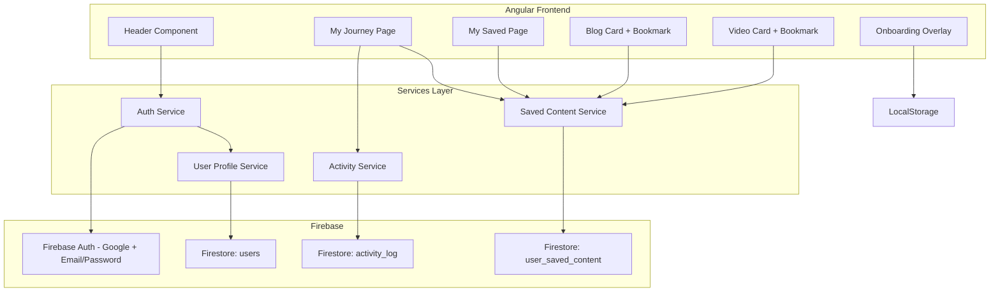
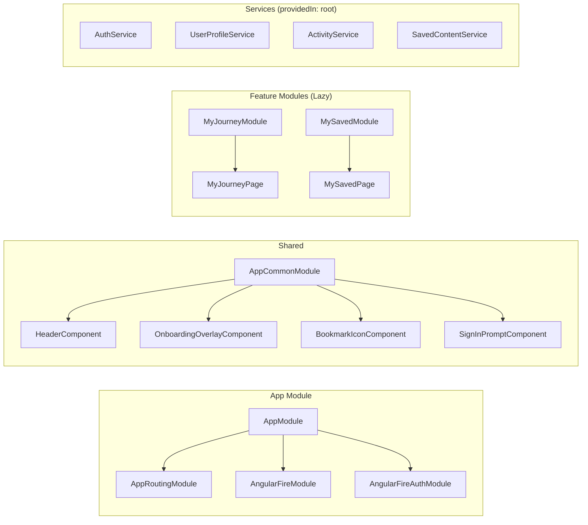

# Design Document: User Engagement Layer

## Overview

The User Engagement Layer introduces user identity, personalization, and activity tracking to the WIOF platform. It extends the existing Angular 16 + Ionic application with Google OAuth sign-in for public users (preserving the admin email/password flow), Firestore-backed user profiles, content bookmarking, activity logging, a personal dashboard, and a first-time onboarding overlay.

The design follows the existing architectural patterns: lazy-loaded page modules, shared components via `AppCommonModule`, `AngularFirestore` compat-mode services, and the established glass-morphism design language with pastel color palette.

**Key Design Decisions:**
- Google sign-in is handled via popup (no separate login page for public users) to minimize navigation friction
- Activity tracking is fire-and-forget — failures never block the user experience
- Streak/visit logic runs on the client using the browser's local timezone for calendar-day determination
- All new Firestore collections use the user's Firebase UID as part of the document path or as an indexed field for efficient queries

---

## Architecture

### High-Level Architecture



### Module Architecture



### Data Flow

1. **Authentication Flow:** User clicks "Sign In" → `AuthService.signInWithGoogle()` → Firebase Auth popup → on success → `UserProfileService.createOrUpdateProfile()` → Firestore `users` collection
2. **Activity Tracking Flow:** User opens content → Page component calls `ActivityService.logActivity()` → deduplication check → Firestore `activity_log` collection (fire-and-forget)
3. **Bookmark Flow:** User clicks bookmark → `SavedContentService.toggleSave()` → Firestore `user_saved_content` → UI updates optimistically with rollback on failure
4. **Visit/Streak Flow:** App initializes with authenticated user → `UserProfileService.recordVisit()` → compares lastLogin day vs today → updates streak/daysVisited accordingly

---

## Components and Interfaces

### New Services

#### AuthService (Enhanced)

Extends the existing `AuthService` at `src/app/services/auth.service.ts`.

```typescript
interface AuthService {
  // Existing
  login(email: string, password: string): Promise<UserCredential>;
  getAuth(): Observable<firebase.User | null>;
  logout(): void;

  // New
  signInWithGoogle(): Promise<UserCredential>;
  currentUser$: Observable<firebase.User | null>;
  isAuthenticated$: Observable<boolean>;
}
```

#### UserProfileService (New)

```typescript
interface UserProfileService {
  getProfile(uid: string): Observable<UserProfile | null>;
  createProfile(user: firebase.User): Promise<void>;
  updateLoginMetrics(uid: string): Promise<void>;
  recordVisit(uid: string): Promise<void>;
  updatePreferredElements(uid: string, elements: string[]): Promise<void>;
}
```

#### ActivityService (New)

```typescript
interface ActivityService {
  logActivity(entry: ActivityLogInput): Promise<void>;
  getActivitiesForUser(userId: string): Observable<ActivityLogEntry[]>;
  getActivityCounts(userId: string): Observable<EngagementMetrics>;
}

interface ActivityLogInput {
  userId: string;
  activityType: 'blog_read' | 'video_view' | 'poll_vote' | 'eq_completion' | 'widget_usage';
  contentId?: string;
  widgetName?: string;
  score?: number;
}
```

#### SavedContentService (New)

```typescript
interface SavedContentService {
  saveContent(item: SaveContentInput): Promise<void>;
  unsaveContent(userId: string, contentId: string): Promise<void>;
  isContentSaved(userId: string, contentId: string): Observable<boolean>;
  getSavedContent(userId: string, pageSize: number, lastDoc?: DocumentSnapshot): Observable<PaginatedResult<SavedContentDocument>>;
  getSavedContentIds(userId: string): Observable<Set<string>>;
}
```

### New Components

| Component | Selector | Location | Purpose |
|-----------|----------|----------|---------|
| OnboardingOverlayComponent | `app-onboarding-overlay` | `components/onboarding-overlay/` | First-time visitor welcome tour |
| BookmarkIconComponent | `app-bookmark-icon` | `components/bookmark-icon/` | Reusable heart/bookmark toggle |
| SignInPromptComponent | `app-sign-in-prompt` | `components/sign-in-prompt/` | Contextual sign-in suggestion for guests |
| AvatarDropdownComponent | `app-avatar-dropdown` | `components/avatar-dropdown/` | User avatar with dropdown menu in header |
| MyJourneyPage | `app-my-journey` | `pages/my-journey/` | Engagement dashboard |
| MySavedPage | `app-my-saved` | `pages/my-saved/` | Bookmarked content listing |

### New Guards

#### PublicUserGuard

Redirects unauthenticated users from protected routes (e.g., `/my-journey`) to home with a sign-in prompt. Unlike the existing `AuthGuard` (which redirects to `/login` for admin), this guard redirects to `/home` and triggers a toast.

```typescript
interface PublicUserGuard {
  canActivate(): Observable<boolean | UrlTree>;
}
```

### Routing Changes

```typescript
// Added to app-routing.module.ts
{
  path: 'my-journey',
  loadChildren: () => import('./pages/my-journey/my-journey.module').then(m => m.MyJourneyPageModule),
  canActivate: [PublicUserGuard]
},
{
  path: 'my-saved',
  loadChildren: () => import('./pages/my-saved/my-saved.module').then(m => m.MySavedPageModule),
  canActivate: [PublicUserGuard]
}
```

---

## Data Models

### Firestore Collections

#### `users` Collection

```typescript
interface UserProfile {
  uid: string;                    // Firebase Auth UID (document ID)
  displayName: string;            // Max 100 characters
  email: string;
  photoURL: string;
  joinedDate: Timestamp;          // Set on first creation
  preferredElements: string[];    // Max 5 items, from ELEMENTS constant
  lastLogin: Timestamp;
  loginCount: number;             // Min 0
  daysVisited: number;            // Min 0
  currentStreak: number;          // Min 0
  savedBlogsCount: number;        // Min 0 (denormalized counter)
}
```

**Document path:** `users/{uid}`

#### `activity_log` Collection

```typescript
interface ActivityLogEntry {
  id?: string;                    // Firestore auto-generated
  userId: string;                 // Indexed
  activityType: 'blog_read' | 'video_view' | 'poll_vote' | 'eq_completion' | 'widget_usage';
  contentId?: string;             // For blog_read, video_view, poll_vote
  widgetName?: string;            // For widget_usage
  score?: number;                 // For eq_completion
  timestamp: Timestamp;
  calendarDay: string;            // "YYYY-MM-DD" for deduplication queries
}
```

**Document path:** `activity_log/{autoId}`
**Composite index:** `userId + activityType + contentId + calendarDay` (for deduplication)

#### `user_saved_content` Collection

```typescript
interface SavedContentDocument {
  id?: string;                    // Firestore auto-generated
  userId: string;                 // Indexed
  contentId: string;
  contentType: 'blog' | 'video';
  contentTitle: string;
  contentThumbnail: string;
  savedAt: Timestamp;
}
```

**Document path:** `user_saved_content/{autoId}`
**Composite index:** `userId + savedAt` (for ordered queries)
**Unique constraint enforced in code:** One document per `userId + contentId` pair

### Streak Calculation Logic

```typescript
function computeStreakUpdate(profile: UserProfile, now: Date, userTimezone: string): StreakUpdate {
  const today = toCalendarDay(now, userTimezone);    // "YYYY-MM-DD"
  const lastDay = toCalendarDay(profile.lastLogin.toDate(), userTimezone);

  if (today === lastDay) {
    // Same day — no streak change
    return { daysVisited: 0, currentStreak: 0, resetStreak: false };
  }

  const daysDiff = diffCalendarDays(today, lastDay);

  if (daysDiff === 1) {
    // Consecutive day — extend streak
    return { daysVisited: 1, currentStreak: 1, resetStreak: false };
  }

  // Gap > 1 day — reset streak
  return { daysVisited: 1, currentStreak: 1, resetStreak: true };
}
```

### Activity Deduplication Logic

```typescript
function shouldRecordActivity(entry: ActivityLogInput, existingEntries: ActivityLogEntry[]): boolean {
  // Only deduplicate blog_read and video_view
  if (entry.activityType !== 'blog_read' && entry.activityType !== 'video_view') {
    return true;
  }

  const today = toCalendarDay(new Date(), getBrowserTimezone());
  return !existingEntries.some(
    e => e.contentId === entry.contentId && e.calendarDay === today
  );
}
```

---

## Correctness Properties

*A property is a characteristic or behavior that should hold true across all valid executions of a system — essentially, a formal statement about what the system should do. Properties serve as the bridge between human-readable specifications and machine-verifiable correctness guarantees.*

### Property 1: Profile Document Integrity

*For any* valid Firebase user object used to create a profile, the resulting UserProfile document SHALL contain all required fields (uid, displayName, email, photoURL, joinedDate, loginCount, lastLogin) with correct types, displayName truncated to at most 100 characters, preferredElements with at most 5 items, and all integer fields at minimum 0.

**Validates: Requirements 1.5, 3.1**

### Property 2: Login Count Monotonic Increment

*For any* existing UserProfile with loginCount N, after a successful sign-in update, the loginCount SHALL equal N + 1 and lastLogin SHALL be updated to the current timestamp.

**Validates: Requirements 1.6**

### Property 3: Visit Streak State Machine

*For any* UserProfile with a given lastLogin timestamp and currentStreak value, and *for any* current date/timezone combination:
- If the current calendar day equals the lastLogin calendar day, daysVisited and currentStreak SHALL remain unchanged
- If the current calendar day is exactly 1 day after the lastLogin calendar day, daysVisited SHALL increment by 1 and currentStreak SHALL increment by 1
- If the current calendar day is more than 1 day after the lastLogin calendar day, daysVisited SHALL increment by 1 and currentStreak SHALL reset to 1

**Validates: Requirements 3.2, 3.3, 3.4**

### Property 4: Save Content Document Creation

*For any* valid content item (blog or video) with a contentId, contentTitle, and contentThumbnail, when saved by an authenticated user, the resulting SavedContentDocument SHALL contain the correct userId, contentId, contentType, contentTitle, contentThumbnail, and a savedAt timestamp that is not in the future.

**Validates: Requirements 4.2**

### Property 5: Unsave Content Removes Document

*For any* previously saved content item, after unsaving, querying the user_saved_content collection for that userId + contentId pair SHALL return no documents.

**Validates: Requirements 4.3**

### Property 6: Bookmark State Consistency

*For any* content item and authenticated user, the bookmark icon filled state SHALL equal true if and only if a SavedContentDocument exists for that userId + contentId pair.

**Validates: Requirements 4.5**

### Property 7: Saved Content Ordering and Pagination

*For any* set of SavedContentDocuments for a user, querying with a page size of 20 SHALL return at most 20 items, and the items SHALL be ordered by savedAt descending (most recently saved first).

**Validates: Requirements 4.6, 5.5**

### Property 8: Activity Metrics Aggregation

*For any* set of activity_log entries for a user, the computed engagement metrics SHALL equal: blogs_read = count of distinct entries with activityType "blog_read", videos_watched = count of distinct entries with activityType "video_view", polls_voted = count of distinct entries with activityType "poll_vote", and last EQ score = score from the most recent "eq_completion" entry.

**Validates: Requirements 5.3**

### Property 9: Activity Logging Correctness

*For any* authenticated user interaction (blog open, video open, poll vote, EQ completion, widget usage), the recorded ActivityLogEntry SHALL contain the correct userId, the matching activityType string, and a timestamp not in the future. For content-based activities, contentId SHALL be present. For widget_usage, widgetName SHALL be present. For eq_completion, score SHALL be present.

**Validates: Requirements 6.1, 6.2, 6.3, 6.4, 6.5**

### Property 10: Guest Activity Exclusion

*For any* interaction performed by a guest user (unauthenticated), the activity_log collection SHALL contain zero new entries attributable to that session.

**Validates: Requirements 6.6**

### Property 11: Activity Deduplication

*For any* userId, contentId, and calendar day, the activity_log collection SHALL contain at most one entry with activityType "blog_read" and at most one entry with activityType "video_view" for that combination, regardless of how many times the user opened the same content on that day.

**Validates: Requirements 6.7**

### Property 12: Guest Prompt Session Persistence

*For any* personalization feature prompt that has been dismissed by a guest user during the current session, subsequent interactions with that same feature SHALL not trigger the prompt again within the same session.

**Validates: Requirements 2.6**

### Property 13: Avatar Fallback Derivation

*For any* authenticated user whose photoURL is unavailable or fails to load, the header SHALL display a circular placeholder containing the uppercase first character of the user's displayName.

**Validates: Requirements 10.3**

---

## Error Handling

### Error Handling Strategy

All errors are classified into two categories:

| Category | Behavior | Example |
|----------|----------|---------|
| **Non-blocking** | Operation fails silently or shows toast; user flow continues | Profile sync failure, activity logging failure, visit streak update failure |
| **User-visible** | Shows inline error with retry option | My Journey data load failure, My Saved data load failure, save/unsave network error |

### Specific Error Scenarios

| Scenario | Handling | Requirement |
|----------|----------|-------------|
| Google auth popup closed by user | Inline error on sign-in area, stay on page | 1.3 |
| Google auth network failure | Inline error message with failure reason | 1.3 |
| Profile creation/update fails after auth | Auth session persists, toast notification | 1.7 |
| Firestore write fails during visit | Silent failure, session continues | 3.5 |
| Save/unsave network error | Revert bookmark icon state, show error message | 4.7 |
| My Journey data retrieval fails | Inline error with retry button | 5.6 |
| Activity logging fails | Silent failure (fire-and-forget pattern) | Implied by non-blocking design |
| localStorage unavailable for onboarding | Don't show overlay, don't error | 7.9 |

### Implementation Pattern

```typescript
// Fire-and-forget pattern (Activity Service, Visit tracking)
async logActivity(entry: ActivityLogInput): Promise<void> {
  try {
    await this.firestore.collection('activity_log').add(entry);
  } catch (error) {
    console.warn('Activity logging failed:', error);
    // Intentionally swallowed — never disrupts user experience
  }
}

// Optimistic update with rollback (Saved Content)
async toggleSave(item: SaveContentInput): Promise<void> {
  const previousState = this.bookmarkState$.value;
  this.bookmarkState$.next(!previousState); // Optimistic update

  try {
    if (previousState) {
      await this.savedContentService.unsaveContent(item.userId, item.contentId);
    } else {
      await this.savedContentService.saveContent(item);
    }
  } catch (error) {
    this.bookmarkState$.next(previousState); // Rollback
    this.toastService.showError('Could not save content. Please try again.');
  }
}
```

---

## Testing Strategy

### Property-Based Testing

This feature contains significant pure business logic (streak calculation, deduplication, metrics aggregation, data validation) that is well-suited for property-based testing.

**Library:** [fast-check](https://github.com/dubzzz/fast-check) (TypeScript PBT library compatible with Jasmine/Karma)

**Configuration:**
- Minimum 100 iterations per property test
- Each test tagged with: `Feature: user-engagement-layer, Property {number}: {title}`

**Properties to implement as PBT:**
1. Profile Document Integrity — generate random Firebase user objects, verify schema compliance
2. Login Count Increment — generate random existing profiles, verify increment logic
3. Visit Streak State Machine — generate random (lastLogin, currentDate, timezone) tuples, verify all three branches
4. Save Content Document Creation — generate random content items, verify document fields
5. Unsave Content Removes Document — generate random saved documents, verify removal
6. Bookmark State Consistency — generate random saved/unsaved content sets, verify icon state
7. Saved Content Ordering and Pagination — generate random document sets, verify ordering and page size
8. Activity Metrics Aggregation — generate random activity log entries, verify computed counts
9. Activity Logging Correctness — generate random activities, verify entry fields
10. Guest Activity Exclusion — generate random guest interactions, verify no entries created
11. Activity Deduplication — generate repeated same-day interactions, verify max one entry
12. Guest Prompt Session Persistence — generate dismiss + re-trigger sequences, verify no re-display
13. Avatar Fallback Derivation — generate random displayNames and broken photo URLs, verify first character displayed

### Unit Testing (Example-Based)

- Auth popup initiation and failure handling
- Onboarding overlay lifecycle (display, dismiss, localStorage interaction)
- Header conditional rendering (guest vs authenticated)
- Avatar dropdown menu behavior (open, close, item click)
- Guest bookmark click prompt display
- My Journey and My Saved empty states
- Component snapshot tests for visual consistency

### Integration Testing

- Full Google sign-in flow with mocked Firebase Auth
- Profile creation and visit recording end-to-end
- Content save/unsave with Firestore emulator
- Activity logging with deduplication across page navigations
- Guard behavior (PublicUserGuard redirect with toast)

### E2E Testing (Cypress or Protractor)

- Guest browsing without encountering auth gates
- Sign in → profile created → My Journey accessible → Logout → Sign In button appears
- Save content → navigate to My Saved → verify content listed
- Onboarding overlay appears on first visit, not on second
- Mobile responsive header behavior

### Test File Organization

```
src/app/services/
  user-profile.service.spec.ts        ← Unit + PBT for streak logic, profile validation
  activity.service.spec.ts            ← Unit + PBT for logging, deduplication, aggregation
  saved-content.service.spec.ts       ← Unit + PBT for save/unsave, pagination
  auth.service.spec.ts                ← Unit tests for Google sign-in flow

src/app/components/
  bookmark-icon/bookmark-icon.component.spec.ts
  onboarding-overlay/onboarding-overlay.component.spec.ts
  avatar-dropdown/avatar-dropdown.component.spec.ts
  sign-in-prompt/sign-in-prompt.component.spec.ts

src/app/pages/
  my-journey/my-journey.page.spec.ts
  my-saved/my-saved.page.spec.ts
```
